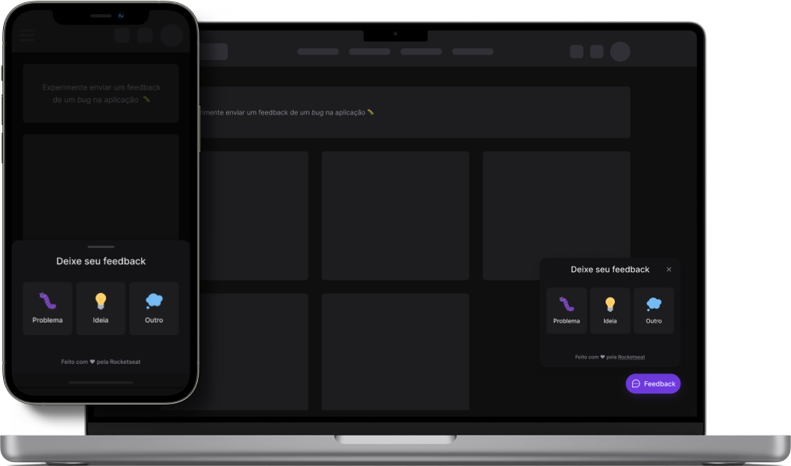

<p align="center">
   
</p>

<h1 align="center">Feedget</h1>

<h3 align="center">
  :rocket: Projeto desenvolvido durante a edição 8 da NLW, disponibilizado pela RocketSeat. 🚀
</h3>

<p align="center">
  <a href="https://rocketseat.com.br">
    
  </a>

  
</p>

# :computer: Tecnologias

Este projeto foi feito utilizando as seguintes tecnologias:

* [ReactJS](https://reactjs.org/)
* [React Native](https://reactnative.dev/)
* [Typescript](https://www.typescriptlang.org/)
* [Tailwind CSS](https://tailwindcss.com/)
* [Expo](https://expo.dev/)
* [ViteJS](https://vitejs.dev/)
* [Express](https://expressjs.com/)
* [Prisma](https://www.prisma.io/)


## Como Iniciar?

### Requisitos

- [Node.js](https://nodejs.org/en/)
- [Yarn](https://classic.yarnpkg.com/) or [npm](https://www.npmjs.com/package/npm)
- [Expo CLI](https://docs.expo.dev/workflow/expo-cli)

**Clone o projeto e acesse a pasta**

```bash
git clone https://github.com/DiogoAMV/nlw-return.git && cd nlw-return
```

**Siga os passos abaixo**

### Server

```bash
# Na pasta raiz do projeto, acesse a pasta 'server'
$ cd server
# Instale as dependências
$ npm install
# Faça uma cópia de '.env.example' para '.env'
# e defina com SUAS variáveis de ambiente.
$ cp .env.example .env
# Com um PostgreSQL em execução, execute as migrações
$ npx prisma migrate dev
# Inicie o server
$ npm run dev
```

### Web

**Certifique-se de ter o servidor rodando**

```bash
# Na pasta raiz do projeto, acesse a pasta 'web'
$ cd web
# Instale as dependências
$ npm install
# Faça uma cópia de '.env.local.example' para '.env.local'
$ cp .env.local.example .env.local
# Inicie a aplicação
$ npm run dev
```

### Mobile

**Certifique-se de ter o servidor rodando**

```bash
# Na pasta raiz do projeto, acesse a pasta 'mobile'
$ cd mobile
# Instale as dependências
$ npm install
# Se você vai emular com android, execute este comando
$ npm run android
# Se você for emular com ios, execute este comando
$ npm run ios
# Ou apenas inicie o pacote
$ npm run start
```

## :memo: Licença

Esse projeto está sob a licença MIT. Veja o arquivo [LICENSE](LICENSE.md) para mais detalhes.

---

Feito com :purple_heart: by [Diogo Marques](https://github.com/DiogoAMV)

[](https://www.linkedin.com/in/diogo-marques-719950221/) 
[](mailto:contato.diogoamv@gmail.com)
